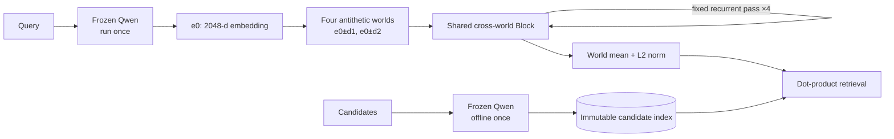

# 2026.8.3

## 目标与实验口径

以 Qwen3-VL-Embedding-2B 为 backbone，研究能否在约 500 万新增参数内，通过 Query
侧共享循环计算接近或超过 LoRA 微调效果。所有指标均采用正式全量测试结果，单位为百分比。

- COCO 汇报 text→image 与 image→text 的等权平均；
- GQA Balanced、CLEVR 汇报 question→answer 检索；
- 固定汇报 mAP、P@1/5/10/20、R@1/5/10/20、MRR、nDCG@10；
- 当前训练均为单数据集、1 epoch、不使用 validation 选 checkpoint。
## 数据集

### 单数据集切分

| Dataset | Train rows | Train images | Validation rows | Validation images | Test rows | Test images |
| --- | ---: | ---: | ---: | ---: | ---: | ---: |
| COCO | 566,747 | 113,287 | 25,010 | 5,000 | 25,010 | 5,000 |
| GQA Balanced | 943,000 | 72,140 | 132,062 | 10,234 | 12,578 | 398 |
| CLEVR | 699,989 | 70,000 | 74,991 | 7,500 | 75,000 | 7,500 |
`rows` 是训练或测试样本数，不等于去重图片数。现有正式实验没有使用 validation。
### 混合数据集切分

| Split | Total rows | COCO | GQA Balanced | CLEVR |
| --- | ---: | ---: | ---: | ---: |
| Train | 100,000 | 50,000 | 35,000 | 15,000 |
| Validation | 10,000 | 5,000 | 3,500 | 1,500 |
| Test | 10,000 | 5,000 | 3,500 | 1,500 |
三个切分均严格按样本行维持 COCO:GQA Balanced:CLEVR = 50:35:15；每个连续 20 行
固定为 10:7:3。Validation 与 test 连续但互不重叠，并已检查唯一 `sample_id`、切分不相交、
校验和及 ready 标志。当前正式指标仍来自单数据集训练，尚无混合训练正式结果。
## 实验演进

| 时间 | 阶段 | 结论 |
| --- | --- | --- |
| 2026-07-30/31 | Frozen Qwen 与全 28 层 LoRA | 建立三个单数据集基线；全层 LoRA 效果最强，但训练 31,195,136 个参数 |
| 2026-07-31 | 旧 mid-decoder latent-slot sweep | COCO K=8/12/16/32 均未稳定超过 frozen；该结构已废弃 |
| 2026-08-01/02 | Query-only recurrent v1 | GQA、CLEVR 提升明显，但 slots 高度坍缩，动态退出大多退化为固定 Pass 4 |
| 2026-08-02/03 | 固定 Candidate、参数匹配 LoRA 与 parallel-world v11 | v11 的 Pass 1 有效，但继续循环造成严重退化，定位到 recurrent update 稳定性问题 |
## 模型协议

### LoRA 基线

- **全 28 层 LoRA**：Query 与 Candidate 都由同一个已微调 backbone 在线编码；
  训练参数 31,195,136。
- **后四层 LoRA**：仍是在线双塔，只在 decoder layers 24–27 加 LoRA；训练参数
  4,456,448。
- **固定 Candidate、Query-only 后四层 LoRA**：Candidate 使用 frozen Qwen 离线
  embedding，只微调 Query 侧后四层；这是与当前 recurrent 最直接的参数匹配对照。
### 第一版 Query-only recurrent

历史 v1 使用冻结的 Layer 7/14/21/28 特征、8 个 slots、共享 recurrent Block 和
最多 4 次更新，共 4,878,321 个训练参数。它证明小型 Query-only 模块能明显改善
GQA/CLEVR，但 COCO 增益很小，slot cosine 接近 1，且 COCO、GQA 的退出控制器
对所有样本都选择 Pass 4。
### 当前 parallel-world v11

Candidate 由 frozen Qwen 离线编码。Query Qwen 只运行一次得到 2,048 维 embedding
`e0`，再构造四个均值保持不变的扰动世界：`e0+d1`、`e0-d1`、`e0+d2`、`e0-d2`。
四个世界通过同一个 cross-world attention + SwiGLU Block 固定循环四次，最终对
完整世界状态取均值并 L2 normalize。模型无 LoRA、无动态退出，训练参数
4,391,554。

## 正式结果

### COCO：等权双向平均

| Model | Params | Output | mAP | P@1 | P@5 | P@10 | P@20 | R@1 | R@5 | R@10 | R@20 | MRR | nDCG@10 |
| --- | ---: | --- | ---: | ---: | ---: | ---: | ---: | ---: | ---: | ---: | ---: | ---: | ---: |
| Frozen Qwen | 0 | Direct | 61.2443 | 64.0153 | 33.9117 | 20.6115 | 11.7428 | 34.2366 | 64.9735 | 75.4542 | 83.6250 | 73.0671 | 66.9576 |
| Full LoRA, online two-tower | 31,195,136 | Direct | **68.0328** | **70.2716** | **37.3290** | **22.4826** | **12.6300** | **38.8849** | **71.0345** | **81.2199** | **88.4540** | **78.5132** | **73.3522** |
| Last-4 LoRA, online two-tower | 4,456,448 | Direct | 64.8443 | 66.7622 | 35.3295 | 21.4518 | 12.1616 | 37.0155 | 68.1486 | 78.5195 | 86.1819 | 75.8752 | 70.3234 |
| Last-4 LoRA, frozen candidates | 4,456,448 | Direct | 64.3934 | 66.5426 | 35.6304 | 21.5128 | 12.1312 | 36.1956 | 67.8769 | 78.0828 | 85.7277 | 75.3080 | 69.8557 |
| Query-only recurrent v1 | 4,878,321 | Dynamic hard | 61.7410 | 64.3811 | 34.1557 | 20.7351 | 11.7851 | 34.5945 | 65.4407 | 75.8581 | 83.8939 | 73.4197 | 67.4011 |
| Parallel-world v11 | 4,391,554 | Pass 4 | 53.2951 | 52.3035 | 27.2186 | 16.8976 | 9.9468 | 31.3662 | 57.1024 | 66.7742 | 75.3729 | 62.1796 | 57.9024 |
### GQA Balanced：answer retrieval

| Model | Params | Output | mAP | P@1 | P@5 | P@10 | P@20 | R@1 | R@5 | R@10 | R@20 | MRR | nDCG@10 |
| --- | ---: | --- | ---: | ---: | ---: | ---: | ---: | ---: | ---: | ---: | ---: | ---: | ---: |
| Frozen Qwen | 0 | Direct | 52.1141 | 36.2697 | 14.4077 | 8.5292 | 4.6554 | 36.2697 | 72.0385 | 85.2918 | 93.1070 | 52.1141 | 59.5010 |
| Full LoRA, online two-tower | 31,195,136 | Direct | 74.9712 | 62.9035 | 17.9043 | 9.3473 | 4.8056 | 62.9035 | 89.5214 | 93.4727 | 96.1123 | 74.9712 | 79.3467 |
| Last-4 LoRA, online two-tower | 4,456,448 | Direct | 71.5734 | 58.5944 | 17.3414 | 9.1310 | 4.7245 | 58.5944 | 86.7069 | 91.3102 | 94.4904 | 71.5734 | 76.2046 |
| Last-4 LoRA, frozen candidates | 4,456,448 | Direct | **75.5850** | **63.1102** | **18.0442** | **9.4021** | **4.8191** | **63.1102** | **90.2210** | **94.0213** | **96.3826** | **75.5850** | **79.9811** |
| Query-only recurrent v1 | 4,878,321 | Dynamic hard | 65.2968 | 49.6979 | 17.1713 | 9.2328 | 4.7714 | 49.6979 | 85.8563 | 92.3279 | 95.4285 | 65.2968 | 71.6876 |
Parallel-world v11 尚未在 GQA Balanced 上运行。
### CLEVR：answer retrieval

| Model | Params | Output | mAP | P@1 | P@5 | P@10 | P@20 | R@1 | R@5 | R@10 | R@20 | MRR | nDCG@10 |
| --- | ---: | --- | ---: | ---: | ---: | ---: | ---: | ---: | ---: | ---: | ---: | ---: | ---: |
| Frozen Qwen | 0 | Direct | 84.9359 | 73.1707 | 19.8499 | 9.9993 | 5.0000 | 73.1707 | 99.2493 | 99.9933 | 100.0000 | 84.9359 | 88.7750 |
| Full LoRA, online two-tower | 31,195,136 | Direct | **99.2076** | **98.4640** | **19.9997** | **10.0000** | **5.0000** | **98.4640** | **99.9987** | **100.0000** | **100.0000** | **99.2076** | **99.4138** |
| Last-4 LoRA, online two-tower | 4,456,448 | Direct | 93.3167 | 87.4560 | 19.9515 | 9.9997 | 5.0000 | 87.4560 | 99.7573 | 99.9973 | 100.0000 | 93.3167 | 95.0396 |
| Query-only recurrent v1 | 4,878,321 | Dynamic hard | 91.2619 | 84.0533 | 19.9277 | 10.0000 | 5.0000 | 84.0533 | 99.6387 | 100.0000 | 100.0000 | 91.2619 | 93.5018 |
固定 Candidate、Query-only 后四层 LoRA 的 CLEVR 实验仍在运行；parallel-world v11
尚未运行 CLEVR，因此均不填指标。
## 关键消融与诊断

### 第一版 recurrent

- COCO R=1 已提升 +0.5286 mAP，R=4 最终只提升 +0.4921；额外循环没有带来
  额外收益。
- COCO/GQA 的动态退出全部选择 Pass 4；CLEVR 只有 9.8933% 样本提前退出。
- K=1/4/8、仅 Layer-28 history 等消融结果几乎一致，slots 的 pairwise cosine
  约为 0.993–0.999，说明多个 slots 实际坍缩成近似同一状态。
### 当前 v11：循环为何失败

| Output | mAP | Change vs frozen Pass 0 |
| --- | ---: | ---: |
| Frozen Pass 0 | 61.2489 | +0.0000 |
| Pass 1 | **63.3390** | **+2.0901** |
| Pass 2 | 60.9085 | −0.3404 |
| Pass 3 | 56.6998 | −4.5491 |
| Pass 4 | 53.2951 | −7.9537 |
第一轮已经学到有效修正，但同一个 Block 继续应用后不断破坏 embedding。正式
Pass 4 比参数量相近的固定 Candidate 后四层 LoRA 低 11.0983 mAP。由此可知：

1. 问题不是新增参数量不足，而是 recurrent dynamics 不稳定；
2. 初始 antithetic 扰动只保证 Pass 0 的均值等于 `e0`，不能保证非线性更新后的
   世界均值仍受控；
3. final-only InfoNCE 能优化最终出口，却没有阻止中间更新过冲或持续漂移；
4. 在解决“后续 Pass 不退化”之前，加入动态退出只会掩盖结构问题。
## 下一步：修复扰动与循环更新

下一版保留 frozen Candidate 和 Query Qwen 单次前向，但把“共同修正方向”与
“平行世界差异”显式分开：

$$
z_i^{(t)} = \operatorname{L2Norm}\left(e_0 + g_t + \delta_i^{(t)}\right),
\qquad
\sum_i \delta_i^{(t)} = 0
$$

- `e0`：固定的 frozen Query 锚点；
- `g_t`：所有世界共享、真正用于改善检索的 common drift；
- `delta_i`：只描述不同世界的零均值探索方向。

每轮先让共享 Block 更新各世界，再强制重新中心化 `delta_i`，防止世界差异
偷偷变成不可控的整体漂移。共同更新采用单位方向和有界步长：

$$
g_{t+1}
=
g_t + \alpha_t\operatorname{L2Norm}(u_t),
\qquad
0 \le \alpha_t \le \alpha_{\max}
$$

训练仍以最终 Pass 的 InfoNCE 为主，只增加小权重的“逐轮不退化”约束，而不是
让每个 Pass 独立拟合同一个目标：

$$
\mathcal{L}
=
\mathcal{L}_{\mathrm{NCE}}(q_4)
+
\lambda\sum_{t=2}^{4}
\max\left(0,
\mathcal{L}_{\mathrm{NCE}}(q_t)
-
\mathcal{L}_{\mathrm{NCE}}(q_{t-1})
+m\right)
$$

第一轮只做 COCO 的 R=1/2/4 和扰动尺度消融。进入全量实验的最低门槛是：

- Pass 2 和 Pass 4 都不能低于 Pass 1；
- Pass 4 必须高于 frozen Pass 0；
- 保持新增参数不超过约 500 万；
- 在固定循环稳定前不重新加入动态退出。

这一步验证的核心不是“扰动是否存在”，而是平行世界能否保留差异，同时把多轮
探索稳定地汇总为一个可监督、可持续改善的 Query embedding。
